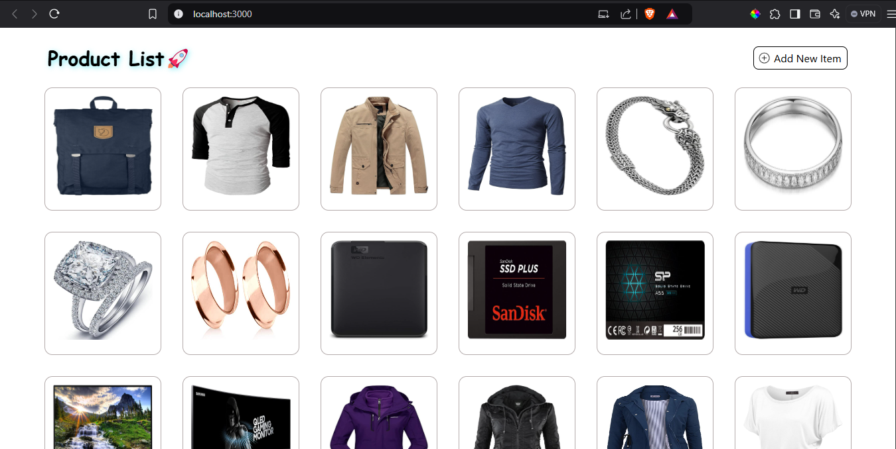

# React application where we are showing List Data in Card format

# 🚀List Data Application🚀

## Functionaliy

- Add New item -> Add Button (CTA)
- Delete Item -> Delete (CTA)
  - hover over the card then able to see the Delete Icon
  - before delelte showing delete confirmation

## API Enpoints

- GET -> `https://fakestoreapi.com/products`

## Depolyed Link

Check out the live demo of the project here : `https://rf-list-app.netlify.app/` 🚀

# Installation

- clone Project using `git clone git@github.com:Tkr-Karan/List-app-assignment.git`
- cd Project name
- use `npm i` for installing dependencies
- start project using `npm start`
- start `localhost:3000`

### Note: Deployed link already present please check
